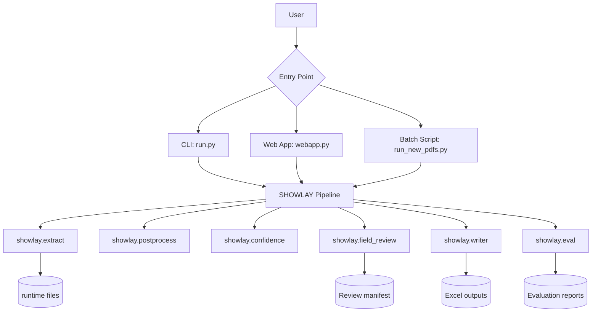
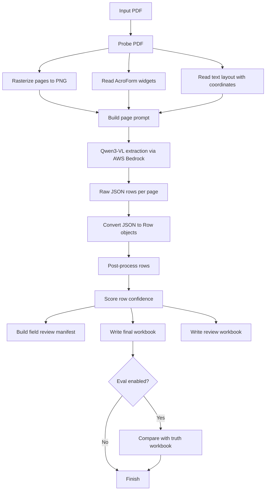
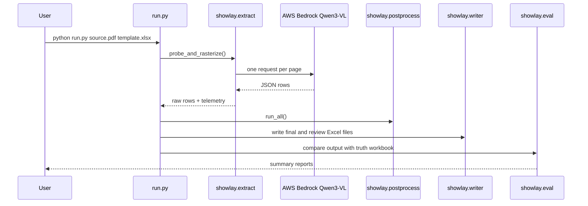
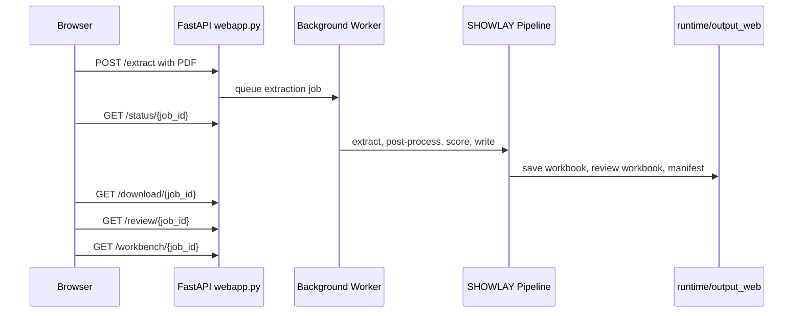

# SHOWLAY Architecture and Workflow

This project converts healthcare form PDFs into a 28-column assessment Excel workbook. It uses PDF structure, page images, text layout, a vision-language model, cleanup rules, confidence scoring, and a human review output.

## What The App Does

1. Reads a source PDF.
2. Converts each PDF page to an image.
3. Reads PDF text positions and form widgets when available.
4. Sends each page image plus layout hints to a vision-language model.
5. Converts the model response into structured workbook rows.
6. Cleans and normalizes those rows.
7. Scores confidence and builds review artifacts.
8. Writes the final Excel file using an existing template workbook.

## High-Level Architecture



## Main Folders And Files

| Path | Purpose |
|---|---|
| `run.py` | End-to-end command-line runner for one PDF and one template/truth workbook. |
| `webapp.py` | Local FastAPI web app for PDF upload, progress tracking, download, and review workbench. |
| `run_new_pdfs.py` | Batch runner for multiple PDFs when no truth workbook is available. |
| `showlay/schema.py` | Defines the 28-column workbook schema and row model. |
| `showlay/extract.py` | Probes PDFs, rasterizes pages, reads widgets/text layout, calls Bedrock Qwen3-VL. |
| `showlay/postprocess.py` | Cleans model output and fixes sections, sequences, branching, types, choices, tables, and duplicates. |
| `showlay/confidence.py` | Assigns confidence scores and row-level review reasons. |
| `showlay/field_review.py` | Builds a field-level JSON review manifest with page evidence and risk levels. |
| `showlay/writer.py` | Writes final Excel and review queue workbooks. |
| `showlay/eval.py` | Compares generated workbook against truth workbook and writes accuracy reports. |
| `runtime/` | Stores generated page images, raw extraction JSON, telemetry, and outputs. |

## Processing Workflow



## Simple Step-By-Step Flow

### 1. PDF Probe And Page Preparation

`showlay.extract.probe_and_rasterize()` opens the PDF with PyMuPDF. For each page, it:

- saves a 200 DPI PNG image,
- checks whether the PDF has fillable form widgets,
- reads widget names, labels, values, types, and rectangles,
- reads visible text lines with page coordinates.

This creates a `DocStructure` object that stores page count, AcroForm status, image paths, widgets, and text blocks.

### 2. Model Extraction

`showlay.extract.extract_document()` sends one page at a time to AWS Bedrock using the Qwen3-VL model. The prompt includes:

- the page image,
- widget details when the PDF is fillable,
- text layout lines from the page,
- the expected extraction schema.

The model returns JSON rows with fields such as:

- `section`
- `sequence`
- `question_type`
- `question_text`
- `branching_logic`
- `answer_text`
- `answer_validation`

### 3. Row Conversion

`showlay.extract.vlm_dicts_to_rows()` converts raw JSON dictionaries into Pydantic `Row` objects from `showlay/schema.py`.

The full workbook has 28 columns, but the model only extracts the PDF-derived fields. Business configuration fields such as alerts, token IDs, IT notes, and auto-populate rules are left blank for later configuration.

### 4. Post-Processing

`showlay.postprocess.run_all()` applies many cleanup passes. In simple terms, it:

- removes repeated page headers and footers,
- removes empty underline-only rows,
- splits combined header bands into separate fields,
- normalizes section headers,
- merges split paragraphs and bullet lists,
- groups choice options,
- normalizes radio buttons, dropdowns, checkboxes, dates, numbers, signatures, and text areas,
- expands packed group table columns,
- assigns final sequence numbers,
- repairs branching logic references.

This step turns model output into workbook-ready rows.

### 5. Confidence Scoring

`showlay.confidence.score_rows()` checks each row and assigns a confidence score from `0.0` to `1.0`.

It checks:

- whether required row fields are present,
- whether the question type is known,
- whether the question text is grounded in the page text,
- whether branching logic points to a valid earlier question.

Rows with lower confidence get review reasons.

### 6. Field-Level Review Manifest

`showlay.field_review.build_review_manifest()` creates a JSON review artifact. It includes:

- source PDF path,
- page image paths,
- extracted rows,
- field-level confidence,
- risk level per field,
- nearest page text evidence,
- suggested reviewer action,
- telemetry from model calls.

This manifest powers the web review workbench and gives reviewers enough evidence to check risky rows.

### 7. Excel Output

`showlay.writer.write_workbook()` clones the template workbook, finds the assessment header row, clears old data rows, and writes the extracted rows into the matching columns.

`showlay.writer.write_review_sidecar()` also creates a review workbook sorted by confidence, with columns for confidence, page, sequence, question text, review reasons, and related fields.

### 8. Optional Evaluation

`showlay.eval.evaluate()` compares a generated workbook with a truth workbook. It reports:

- candidate row count,
- truth row count,
- matched rows,
- row recall,
- row precision,
- per-field exact and fuzzy accuracy,
- missed truth rows,
- extra candidate rows.

## CLI Workflow



Run example:

```bash
python run.py "<source-pdf>" "<truth-or-template-xlsx>"
```

Main outputs are written under:

```text
runtime/output/<stem>/
```

## Web App Workflow



Start the web app:

```bash
python webapp.py
```

Then open:

```text
http://localhost:8000
```

The web app supports:

- PDF upload,
- background extraction jobs,
- polling for progress,
- workbook download,
- review workbook download,
- review manifest download,
- browser-based review workbench.

## Outputs

| Output | Meaning |
|---|---|
| `<stem>.xlsx` | Final 28-column workbook generated from the template. |
| `<stem>_review.xlsx` | Review queue sorted by confidence. |
| `<stem>_review_manifest.json` | Field-level review data with page evidence. |
| `raw_vlm.json` | Raw JSON rows returned by the model. |
| `telemetry.json` | Per-page model timing and token usage. |
| `summary.json` / `summary.md` | Evaluation results when truth comparison is enabled. |

## Tools And Libraries Used

| Tool | Used For |
|---|---|
| Python | Main programming language. |
| FastAPI | Local web API and upload/download app. |
| Uvicorn | Runs the FastAPI server. |
| PyMuPDF (`fitz`) | Opens PDFs, rasterizes pages, reads text layout and AcroForm widgets. |
| AWS Bedrock Runtime (`boto3`, `botocore`) | Calls the Qwen3-VL vision-language model. |
| Qwen3-VL-235B | Vision-language extraction from page images. |
| Pydantic | Defines and validates row data models. |
| OpenPyXL | Reads template workbooks and writes Excel outputs. |
| python-dotenv | Loads `.env` configuration such as AWS region and model ID. |
| ThreadPoolExecutor | Runs web extraction jobs in the background. |
| Mermaid | Documents architecture and workflow diagrams in Markdown. |

## Configuration

The app loads environment settings from `.env`.

Common settings include:

```text
AWS_REGION
BEDROCK_VLM_MODEL_ID
```

If `BEDROCK_VLM_MODEL_ID` is not set, the code defaults to:

```text
qwen.qwen3-vl-235b-a22b
```

## Current Design In Plain Words

The project does not depend only on OCR or only on a language model. It combines multiple signals:

- page images show what the form looks like,
- PDF text layout provides searchable text and coordinates,
- AcroForm widgets reveal field types in fillable PDFs,
- the model converts visual and structural evidence into workbook rows,
- post-processing fixes common model mistakes,
- confidence scoring tells humans what needs review,
- the Excel writer preserves the provided workbook template.

This makes the workflow practical for varied healthcare form PDFs, especially when layouts differ from one form to another.
